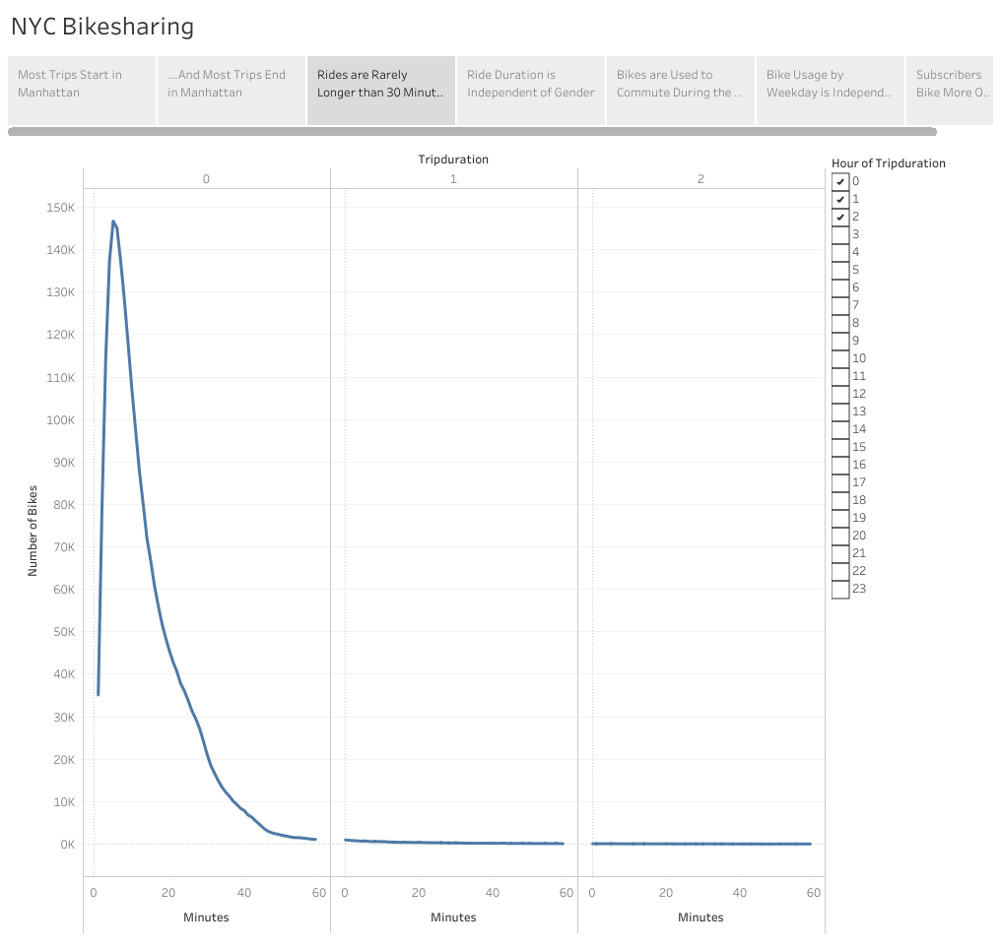

# Bikesharing Analysis

# Overview
## Purpose
This analysis provides a look at CitiBike data from August of 2019 in New York City. The purpose is to find and communicate trends in the data using easily understandable visualizations, created with Tableau Public.

## Results
### Most trips start and end in Manhattan
START LOCATIONS

END LOCATIONS

### Rides occur during the weekly work commute and are relatively short
RIDE TIMES

RIDE DURATIONS

### Men bike more than Women
RIDE DURATION BY GENDER

WEEDAY USE BY GENDER

SUBSCRIBERS VS CUSTOMERS BY GENDER

